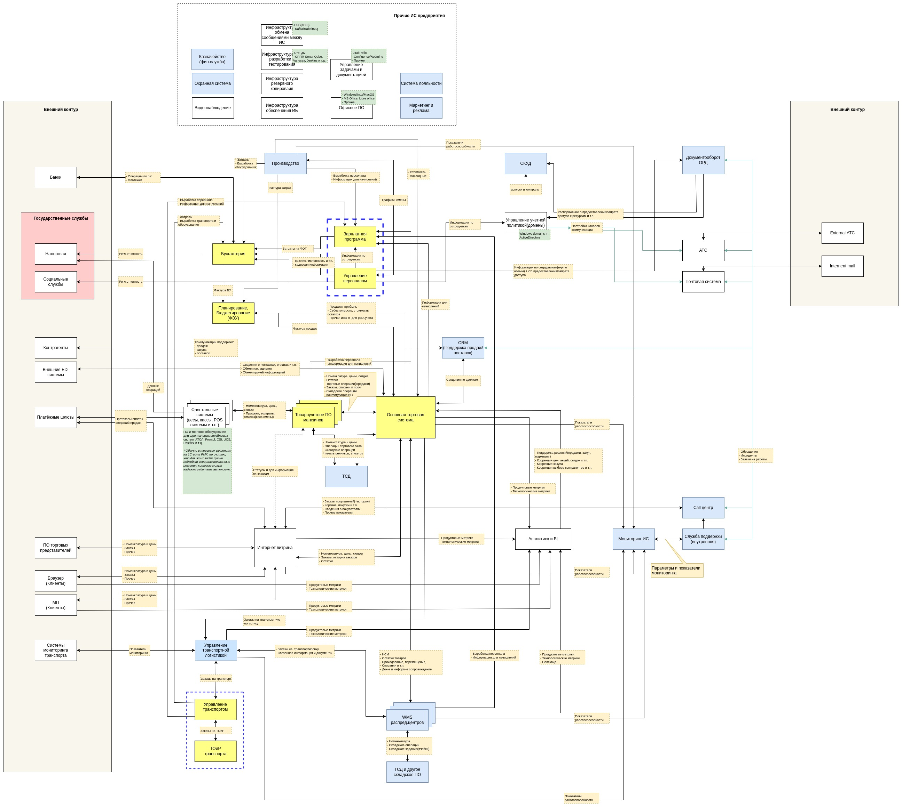

# testtask_small

## Содержание

- [Задание](#task)
- [Описание вакансии](#vacancy)
- [Решение](#solution)
    - [Комментарий к решению](#solution-comment)

<a name="task"><h2>Задание</h2></a>

**Тестовое задание для архитектора:**

Разработать проект целевой ИТ-архитектуры для компании из сектора FMCG.
Проект должен включать в себя верхнеуровневую схему ИТ-компонентов, необходимых для обеспечения всей жизнедеятельности компании (не только продажи, но и учет), а также потоки данных между ними.
В идеале дать предложения по выбору системы для каждого из компонентов – использовать коробочное решение (какое) или разрабатывать свое (на каком стеке технологий).

Описание компании:
* Ритейлер продуктов питания и сопутствующих товаров с сетью магазинов разного формата (гипермаркеты, супермаркеты, магазины у дома) по всей территории РК
* Широкий ассортимент. Централизованные поставки от многочисленных поставщиков через собственные распределительные склады (РЦ). Собственная служба складской и транспортной логистики.
* Оптовые продажи
* E-Commerce с самовывозом и собственной сборкой и доставкой товаров клиентам. Сайт интернет-магазина + мобильное приложение для клиентов.
* Коллцентр для обслуживания клиентов

<a name="vacancy"><h2>Описание вакансии</h2></a>
#вакансия#Алматы#удаленка#Enterprise architect 

Компания в Казахстане, которая имеет развитую сеть супермаркетов ищет Системного архитектора 
 
Обязанности: 
* Разработка целевой ИТ-архитектуры Enterprise-уровня; 
* Реализация проекта по переходу к целевой ИТ-архитектуре; 
* Проектирование гибкой, масштабируемой, отказоустойчивой и высоконагруженной ИТ-архитектуры ПО уровня Enterprise (выбор технологий/инструментов разработки/готовых модулей, декомпозиция на модули, определение протоколов взаимодействия модулей между собой и с внешними системами); 
* Определение стандартов разработки и контроль за их соблюдением; 
* Согласование требований на доработку ПО, формулировка нефункциональных требований, подготовка технических проектов; 
* Контроль исполнения архитектурных принципов и решений, разработка архитектурной документации, ее защита и актуализация; 
* Архитектурный надзор за разработкой, включая технический аудит работ, выполняемых сторонними подрядчиками; 
* Планирование технологического развития ПО, рефакторинг и оптимизация, мониторинг и внедрение новых технологий в комплексных решениях и компонентах, управление технологическим долгом. 
Требования: 
* Опыт работы архитектором или ведущим разработчиком в крупных ИТ проектах (предпочтительно Ритейл) не менее 3 лет, E-Com проектах не менее 1 года; 
* Опыт проектирования масштабных высоконагруженных информационных систем и сервисов (включая WEB и мобильные приложения, E-Commerce) , сложных распределенных, отказоустойчивых систем на базе сервисной и микросервисной архитектуры; 
* Опыт разработки архитектурной документации (функциональная, компонентная, развертывания и т.д.); 
* Опыт разработки, описание и согласование сценариев интеграционного взаимодействия ИТ систем; 
* Проектирование компонентов на уровне модулей, интерфейсов; 
* Понимание и навыки использования методологии TOGAF; 
* Отличные знания стека технологий (HTTP, gRPC, REST API, JSON, XML, PHP, Golang); 
* Опыт работы с Message-oriented middleware (Kafka, RabbitMQ, Websphere MQ и т.п.); 
* Хорошие навыки и опыт проектирования СУБД: PostgreSQL, MSSQL, Mysql, MongoDB, Redis, Memcached, Tarantool и пр. Уверенное знание SQL; 
* Опыт работы с ETL-инструментами; 
* Опыт проектирования ИТ-инфраструктуры с применением технологии Docker, Kubernetes, Prometheus, Grafana, ELK и пр.; 
* Уверенное знание принципов построения ИТ инфраструктуры с реализацией схем HA (High Availability) и DR (Disaster Recovery); 
* Уверенное знание методологий принципов разработки ПО, включая гибкие(Agile, SCRUM); 
* Готовность к большому количеству коммуникаций; 
* Умение и готовность работать в условиях часто меняющихся требований 
 
Формат работы: желательно в офисе, г.Алматы, Казахстан, но возможно рассмотреть вариант 100% удаленной работы.  

<a name="solution"><h2>Решение</h2></a>

### Предварительные замечания

1. На мой взгляд, задание отличается очень общей формулировкой. Из него не ясны требования к системам и автоматизируемым процессам. Одни и те же процессы могут быть реализованы на различных предприятиях очень по-разному. Также не ясны внутреннее устройство и взаимодействие структурных подразделений. Не понятно, как устроена система принятия управленческих решений, нет сведений о имеющихся и доступных ресурсах и т.п. Без всего этого выполнение проекта невозможно. Возможны лишь верхнеуровневые прикидки. И кажется, правильнее назвать эту работу - составлением скетча.
2. Схема ИТ-компонентов представляет из себя самый простой (т.н. "Box and arrows") вариант представления сущностей. Я сознательно не стал усложнять описание, инфопотоки описаны прямо "на стрелках". Кроме того, инфопотоки не делятся на входящие и исходящие, т.к. на стадии скетча это кажется лишним.
3. На схеме не учитываются особенности сетевого взаимодействия, не показаны очереди и интерфейсы взаимодействия ИС.
4. На схеме жёлтым цветом отмечены те ИС, которые, как мне кажется, могут быть быстро и легко автоматизированы ПО на базе платформы 1С.(Решения на базе 1С популярны и хорошо зарекомендовали себя на рынке СНГ за последние десятилетия. Решения отличаются невысокой стоимостью, хорошей производительностью и гибкими возможностями. Данное ПО можно очень быстро дорабатывать под требования своего бизнеса, за сравнительно невысокую стоимость и без участия вендора, т.е. силами штатных (или привлекаемых со стороны) ИТ специалистов.)
5. На схеме голубым цветом отмечены те ИС, которые, как мне кажется, могут быть автоматизированы на базе решений на 1С, однако в ряде случаев более подходящими могут оказаться решения на других платформах.
6. На схеме зелёным цветом для некоторых ИС добавлены комментарии по предполагаемому ПО.

<a name="solution-comment"><h2>Комментарий к схеме ИТ-компонентов</h2></a>

### --- отмеченные жёлтым цветом ---

1. Бухгалтерия

    В зависимости от требований и структуры организации необходимо использовать один или несколько экземпляров соответствующего ПО. Считаю, что типовое решение от 1С:Бухгалтерия подходит для этой задачи идеально.

2. Зарплата и управление персоналом

    Не зная структуры организации и особенностей системы начисления, сложно говорить о том, сколько экземпляров соответствующего ПО может понадобиться. Тем не менее, считаю отличным вариантом для автоматизации процессов расчета зарплаты и управления персоналом - типовое решение от 1С:ЗУП.

3. Планирование, Бюджетирование (может быть и УУ)

    Кажется, что для автоматизации этого контура учёта, лучше выбрать коробочное отраслевое решение от 1С, либо использовать соответствующий модуль типового решения.

4. Основная торговая система

    Кажется, что правильным подходом было бы использовать несколько основных торговых систем - по видам бизнеса, т.е. одна система для оптовой торговли, другая - для розничной и т.п. Однако, без детальных требований, нельзя однозначно сказать, как правильно. Поэтому я решил выделить одну ИС в качестве основной торговой системы. Мне кажется, что будет хорошим вариантом строить данную ИС на основе типового решения 1С:УТ (причем версии 10.3).

5. Товароучетное ПО в магазинах

    Считаю, что в магазинах для обеспечения надежности (и скорости выполнения ряда операций) должны быть установлены отдельные экземпляры товароучетного ПО. Понятно, что для снижения затрат на поддержку и разработку, конфигурации во всех магазинах должны быть по-возможности одинаковыми. Поэтому, мне кажется, что отличным вариантом ИС будет использование подхода "Распределенных БД" от 1С на базе какого-нибудь отраслевого решения (например, 1С:Розница, Рарус ТКТП и т.п.).
    Если предполагается, что клиенты смогут забирать свои заказы из магазинов, то хорошей идеей кажется – наличие выделенного инфопотока с Интернет-витриной для передачи статусов готовности заказов.

6. Управление транспортом (и ТОиР транспорта)

    Если честно, то мне кажется, что у компании есть только автомобильный транспорт, а раз так, то отличным решением для автоматизации этого участка учёта будет решение на базе отраслевой 1С Рарус Управление автотранспортом.

### --- отмеченные голубым цветом ---

7. Управление транспортной логистикой

    У Раруса и других компаний-разработчиков на 1С есть решения для автоматизации логистики, но я эти решения не знаю и с ними не работал. Однако, если такие решения подходят под требования бизнеса, то, наверное, это будет хороший вариант. Особенно хороший вариант будет, если это будет решение того же вендора, что и для п.6 - тогда эти пункты и ИС можно на схеме объединить.

8. WMS распределительных центров

    Работа распредцентров должна быть автономной, поэтому в каждом распредцентре необходимо иметь отдельную ИТ-инфраструктуру и учетную складскую систему. 
    Для WMS, решения на 1С не всегда могут быть подходящими, т.к. платформа все же имеет ограничения по части скорости и масштабируемости. Тем не менее, на 1С есть продукты, которые стоит посмотреть: Рарус WMS, Sevco WMS, RS.WMS, решения Axelot и т.п.

9. Производственный учет

    На базе 1С есть множество хороших отраслевых решений практически под любую специфику.

10. Call-центр, Мониторинг ИС, Служба поддержки

    Эти участки могут быть успешно автоматизированы на базе 1С с помощью готовых отраслевых решений либо собственных разработок.

11. Документооборот

    Документооборот можно автоматизировать на базе 1С, например, существует довольно мощная одноименная типовая конфигурация. Но, не уверен, что эта система устроит всех, т.к. довольно специфична.

12. CRM система поддержки продаж/поставок

    Подобную систему вполне можно реализовать своими силами в т.ч. и на 1С, либо поискать что-то готовое.

13. ТСД

    У 1С есть т.н. Мобильная платформа, позволяющая разрабатывать решения для мобильных устройств. Кажется, имеет смысл посмотреть в сторону соответствующих решений. А если окажется, что мобильная платформа 1С не подходит, то посмотреть на те решения, которые наиболее простым образом могут быть интегрированы с решениями на базе 1С (если таковые используются для взаимодействия).

14. СКУД, Казначейство, Охранная учетная система, Система лояльности, Система 
поддержки маркетинга и рекламы

    Данные системы также могут быть реализованы на базе решений 1С.

### --- не отмеченные цветом ---

15. Аналитическая система

    Данная система в силу специфики своих задач должна быть построена с применением OLAP подходов и использовать соответствующие технологии (ClickHouse, ELK и т.п.). Что же касается прикладного анализа данных, то затрудняюсь выбором ПО и тем, какие технологии лучше. Предположу, что решения здесь зачастую "кастомные" и могут строиться на библиотеках python (pandas, numpy, deap, matplotlib и ряда других).

16. Интернет-витрина

    Уверен, что решение должно быть "кастомным", уметь в виртуализацию и горизонтальное масштабирование, поддерживать многопоточность и асинхронность. Вероятно, хороший вариант, использовать backend на базе golang.

### Примерный состав и контуры ответственности подразделений ИТ-службы

* Call центр:
	- взаимодействие с клиентами
	- регистрация и работа по инцидентам

* Группа сопровождения
	- мониторинг систем
	- системы видеонаблюдения
	- СКУД и взаимодействие с охранными системами
	
* Служба поддержки:
	- поддержка пользователей
	- поддержка и развитие сети
	- телефония и почта
	- офисное ПО
	- учет техники и расходников
	- замена, установка и ремонт техники

* Инфраструктурная группа:
	- информационная безопасность
	- управление доменом и политиками
	- поддержка и развертывание серверов, систем хранения, тестовых и сборочных стендов
	- системы тестирования, документирования, управления задачами
	
* Группа развития аналитических систем
	- поддержка и развитие аналитических систем
	
* Группа развития Интернет систем
	- frontend(в т.ч. мобильная разработка) и backend Интернет витрины
	- поддержка и развитие Интернет витрины
	
* Группа развития WMS систем
	- поддержка и развитие WMS систем
	- ТСД и другое складское оборудование и ПО
	
* Группа развития корпоративных систем
	- бухгалтерия
	- планирования и бюджетирование(+УУ)
	- зарплата
	- управление персоналом
	- различные CRM и системы поддержки 
	- управление транспортом и транспортной логистикой
	- основная торговая система
	- торговые системы магазинов
	- фронтальные системы магазинов(+ ТСД и прочее для работы магазинов)